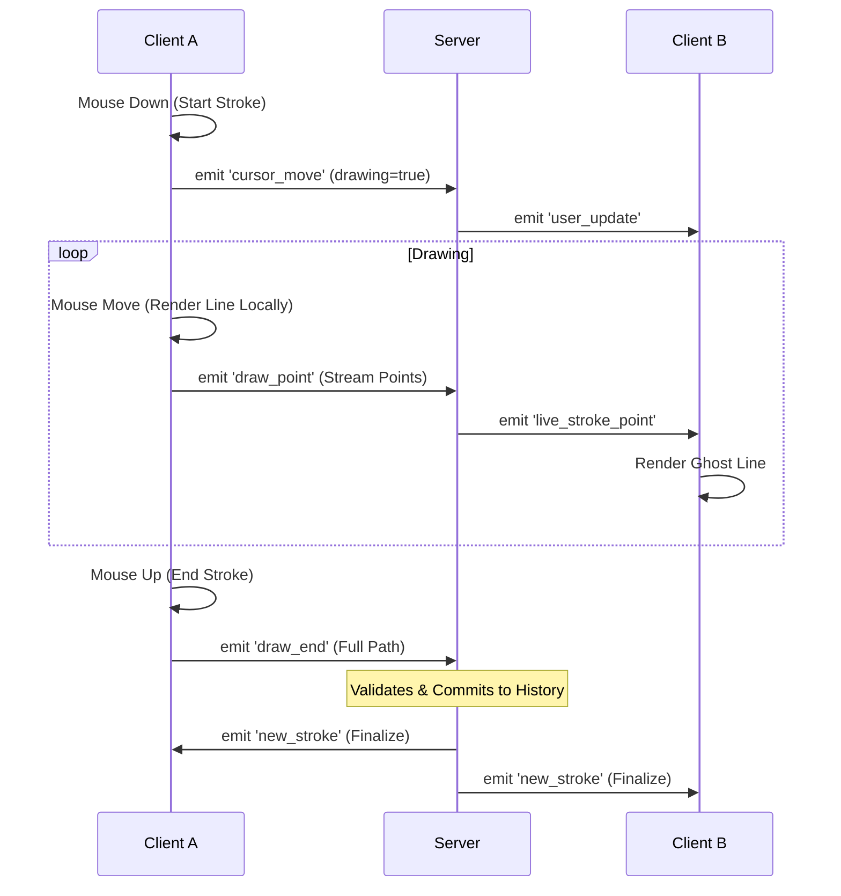

# Architecture Documentation

## 🏗️ System Overview

The application follows a standard **Client-Server** architecture using **WebSockets** for full-duplex communication. The server acts as the central authority for the drawing state, ensuring consistency across all connected clients.

### Stack
- **Server**: Node.js, Express, Socket.io
- **Client**: Native HTML5 Canvas API, Socket.io Client
- **Data Structure**: In-memory Javascript Arrays/Maps (for simplicity in this assignment).

## 🔄 Data Flow

## 📡 WebSocket Protocol

| Event | Direction | Payload | Description |
|-------|-----------|---------|-------------|
| `init_state` | Server -> Client | `{ history, users, me }` | Sent on connection. Full state sync. |
| `cursor_move` | Client -> Server | `{ x, y, isDrawing }` | User moved mouse. |
| `user_update` | Server -> Client | `{ id, x, y, isDrawing }` | Broadcast user cursor updates. |
| `draw_point` | Client -> Server | `{ point: {x,y} }` | Streaming a point during active drawing. |
| `live_stroke_point` | Server -> Client | `{ userId, point, color }` | Broadcast streamed point to others. |
| `draw_end` | Client -> Server | `{ points: [], width }` | User finished stroke. |
| `new_stroke` | Server -> Client | Stroke Object | A stroke was committed to history. |
| `undo_request` | Client -> Server | `null` | Request to undo last global action. |
| `history_undo` | Server -> Client | `{ id }` | ID of the stroke that was undone. |

## ↩️ Undo/Redo Strategy (Global)

We implemented a **Global Command Pattern**.
1.  **Single Truth**: The server maintains a `history` array (stack) of all completed strokes.
2.  **Global History**: There is no per-user history. If User A acts, then User B acts, the history is `[A, B]`.
3.  **Undo Logic**: An undo request pops the last element of `history`.
    - If User A clicks Undo, `B` is popped.
    - This ensures state consistency. Everyone sees the exact same canvas state.
4.  **Client Sync**: When an undo happens, the server sends `history_undo` with the ID. Clients remove that specific stroke from their local persistent storage and redraw the canvas.

## ⚔️ Conflict Resolution

- **Concurrent Draws**: Handled by the nature of WebSockets and the Event Loop. The server processes `draw_end` events sequentially.
- **Concurrent Undos**: If two users click undo at the exact same time, the server processes them in order of arrival. The first request undoes the last action, the second request undoes the action before that.
- **Overlapping Lines**: Canvas naturally handles this via Painter's Algorithm (newer strokes draw on top). The `history` array is ordered by insertion time.

## 🚀 Performance Decisions

1.  **Optimistic Rendering**: The client draws immediately on the user's screen without waiting for the network, ensuring zero latency feel.
2.  **Streaming vs. Batching**: We stream points (`draw_point`) for the "live" view on other screens, but we save the full path (`draw_end`) for the permanent history. This keeps the history clean and allows for path simplification algorithms (if added later) before storage.
3.  **Quadratic Curves**: Instead of raw line segments, we use quadratic curve interpolation between points to ensure strokes look smooth even if mouse events are sparse.
